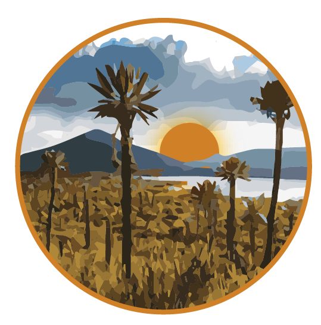

---
title: "PARAMO Tutorial"
output: rmarkdown::html_vignette
vignette: >
  %\VignetteIndexEntry{PARAMO}
  %\VignetteEngine{knitr::rmarkdown}
  \usepackage[utf8]{inputenc}
---https://happygitwithr.com/github-pat.html

```{r echo=FALSE, message=FALSE}
#
library("SCATE.shortcourse")
knitr::include_graphics("https://github.com/sergeitarasov/PARAMO/raw/master/icon-paramo.png", dpi=100)
```

***P**hylogenetic **A**ncestral **R**econstruction of **A**natomy by **M**apping **O**ntologies*

The $PARAMO$ pipeline requires three initial pieces of data: a character matrix, a dated phylogeny, and an anatomy ontology. Herein, we use a set of 19 characters from OntoTrace and a large-scale phylogeny of fishes from  [@rabosky2018]. In this demonstration, we are interested in constructing the amalgamated characters for the three levels of amalgamation (=anatomical hierarchy): anatomical dependencies (ADs), body regions (BRs) and entire phenotype (EF). At the BR level, three main body types are considered -- "dermatocranium", "paired fins" and "external integument structures". 

# STEP 1. Initial character matrix

We are going to retrieve our dataset from the Phenoscape Knowledgebase for demonstration purposes as our starting point. We are then going to reconstruct the history of these traits accounting for dependencies among them and amalgamating them according to trait type using the UBERON Anatomy Ontology. 

```{r eval=FALSE}
# Define our traits
terms <- c("dermatocranium", "paired fin", "barbel") 
# Define our taxon
taxon <- "Siluriformes"   

# Apply pk_get_ontotrace_xml over all our traits in our taxon of interest, the Siluriformes and retain
# variable characters. If you want to return invariant characters instead, select variable_only=FALSE. 
nex <- lapply(terms, pk_get_ontotrace_xml, taxon=taxon, variable_only=TRUE)
names(nex) <- terms

.m <- lapply(nex, pk_get_ontotrace)

# Merge together the resulting 3 matrices and remove non-trait data (OTU identifiers) and duplicated columns (if present)
m <- purrr::reduce(.m, full_join, by="taxa", suffix=c("", ".y"))  
m <- dplyr::select_at(m, dplyr::vars(-contains("otu"))) # Removes otu data
siluriformes <- dplyr::select_at(m, vars(-contains(".y"))) # Removes duplicated columns
print_coverage(siluriformes)
```

To save time, simply run the line below rather than the chunk above.

```{r}
data(siluriformes)
print_coverage(siluriformes)
```


The table that prints out shows the number of taxa for which there is data in the KB ( _coverage_ ) and the proportion of taxa ( _average_ ) that have this trait present (all of these are binary, presence/absence characters). 

This dataset is too big for our demonstration purposes. So let's filter down to a smaller set of traits that will illustrate our process. 

```{r}
dat <- dplyr::select(siluriformes,"taxa", 
              "vomer", "accessory vomerine tooth plate", "ectopterygoid bone",
              "mental barbel", "inner mental barbel", "outer mental barbel", "anterior nasal barbel", "posterior nasal barbel",
              "urohyal", "urohyal lateral process", "urohyal median process",
              "pectoral fin spine", "anterior dentation of pectoral fin spine", "posterior dentation of pectoral fin spine", 
              "pectoral fin",
              "pelvic fin", "pelvic splint", "pelvic fin ray"
              )

## Let's also clean up some of the species names to only include Genus and species (drop subspecies etc.)
dat$taxa <- unname(sapply(dat$taxa, function(x) paste(strsplit(x, split=" ")[[1]][1:2], collapse="_")))

head(dat)
```

Now let's load in the Rabosky fish phylogeny and match it to the data using `treeplyr`.

```{r}
data(fishtree)
td <- make.treedata(fishtree, dat)
td
```

We want to learn about these traits, so we're going to build a nice data table to see what these traits are and their unique identifiers using the KB API and `rphenoscape` function `pk_anatomical_detail`. 

```{r}
traits <- colnames(td$dat)
anatomical_details <- lapply(traits, pk_anatomical_detail) # Query over traits and get anatomical details 

char_info <- list()
char_info$ID <- traits
char_info$definition <- sapply(anatomical_details, function(x) x$definition) # Extract definitions
char_info$STATE_0 <- rep(0, length(traits)) # All ontotrace matrices are binary presence/absence
char_info$STATE_1 <- rep(1, length(traits)) # All ontotrace matrices are binary presence/absence
char_info$IRI <- sapply(anatomical_details, function(x) x$id) # Extra a unique URL identifier called an "IRI" 
char_info$IRI <- gsub("http://purl.obolibrary.org/obo/", "", char_info$IRI)
char_info$IRI <- gsub("_", ":", char_info$IRI)

char_info <- data.frame(char_info)
as_tibble(char_info)

```

We can construct a heat map that is organized by the semantic similarity of the traits to visualize our dataset. The phylogeny is displayed on the left side, and a tree of traits is on the top.

```{r}
njt <- makeTraitTree(td, skip=NULL)
njt <- root(multi2di(njt), grep("barbel", njt$tip.label))
ontologyHeatMap(td, njt, start=1, cex=0.25)
```

Some of our taxa are really data poor, so let's filter them out and deal with a smaller, more manageable dataset by excluding all taxa that don't have at least 40% of the traits as data.

```{r}
tdf <- filter_coverage(td, traits=0, taxa=0.4)
njt <- makeTraitTree(tdf, skip=NULL)
njt <- root.phylo(njt, grep("barbel", njt$tip.label))
ontologyHeatMap(tdf, njt, start=1, cex=0.25)
```

Next, we want to identify the dependencies in our traits by using `rphenoscape::pa_dep_matrix`, which returns a presence-absence dependency matrix when provided a list of terms. In other words,
it returns which traits depend on the presence of another trait. This will be key information for building our evolutionary models, as not considering it can result in impossible ancestral state
reconstructions and can also help the pseudoreplication that occurs when considering non-independent characters in phylogenetic analyses. 

```{r}
dep.mat <- pa_dep_matrix(gsub("N:", "N_", paste0("http://purl.obolibrary.org/obo/", char_info$IRI, sep="")), .names="label", preserveOrder=TRUE)
diag(dep.mat) <- NA
G1 <- igraph::graph_from_adjacency_matrix(remove_indirect(t(as.matrix(dep.mat))))

con.comp <- igraph::components(G1, "weak") # Organizes the subgraphs within our graph and allows us to pick out connected pieces


plot(G1, vertex.size=5, edge.arrow.size=0.5, vertex.label.cex=0.75)
pf.group <- con.comp$membership["pectoral fin"] ## Which group contains "pectoral fin"
pf.Graph <- igraph::induced_subgraph(G1, which(con.comp$membership==pf.group)) ## Pick out the subgraph with "pectoral fin"
plot(pf.Graph, vertex.label.cex=0.75)
```
In the dependency graph above, for example, you can see that the presence of the pectoral fin spine is dependent on the presence of the pectoral fin.

Now we can build in our dependencies into our evolutionary models by amalgamating characters based on their dependency structure (pulled from the graph).

```{r}
amal.deps <- amalgamate_deps(dep.mat) ## Create an object of transition matrices for the amalgamated characters
td.comb <- recode_traits(tdf, amal.deps) ## Recode the original dataset according to the character states of the new, amalgamated characters (with Hidden states)
```

If the above code didn't work for you, you can catch up by loading this dataset from the `scate-shortcourse` package

```{r}
data(td.comb)
```

We can reconstruct our stochastic character maps by first fitting the model in the R package `corHMM`, then using the model fit to generate stochastic maps in `phytools`. In the workshop, we will do a Julia Child-style switch-a-roo and analyze completed analyses, rather than actually running these, because they will take too long.

```{r eval=FALSE}
## WARNING: VERY TIME CONSUMING (~15-30 minutes)
corhmm.fits <- amalgamated_fits_corHMM(td.comb, amal.deps)
```

```{r}
data(corhmm.fits)
trees <- amalgamated_simmaps_phytools(corhmm.fits, nsim=2) # Create 2 stochastic character maps per character
```

We can plot these simmap trees immediately and see what it looks like, we will do this again shortly with prettier labeling and colors. 

```{r}
par(mfrow=c(3,3))
for(i in 1:length(trees)){
  states <- ncol(corhmm.fits[[i]]$index.mat)
  phytools::plotSimmap(trees[[i]][[1]], ftype="off")
}
```


Our next step is to aggregate the traits by their trait types. This part is not quite done by the phenoscape API, so we're going to interact directly with the UBERON ontology. In the future, this will not be necessary.
To construct manually, you simply need to provide a list of how you want the traits aggregated.


```{r}
# let's modify our character info to drop dependent states and match our new amalgamated characters
char_info_comb <- dropDependentTraits(char_info, dep.mat, td.comb)
data(UBERON)
BR_names <- c("dermatocranium", "paired fin", "external integument structure")
EF_names <- c("anatomical structure")

BR <- RAC_query(char_info_comb, UBERON, BR_names)
EF <- RAC_query(char_info_comb, UBERON, EF_names)
```

This next section stacks stochastic character maps by aggregation level, making new amalgamated super-characters. We do this at 3 levels. 

```{r}
#############
# Individual characters
#############
# This is a function to processes the individual rayDISC maps produced by corHMM and discretizes the maps to ease amalgamation. 
# For individual characters, no additional processing is necessary
IND.maps <- prepareMapsRayDISC(td.comb, trees, discretization_level=100)


#############
# Amalgamation at the BR level
#############
# we use the ouput `BR` from the RAC query obtained at Step 3. 
# This ouput contains character IDs for BR terms
# Let's rename those IDs to match the file names of the stochastic maps
cc2 <- BR
cc2 <-lapply(cc2, function(x) gsub(" ", "_", x) )

# creating BR.maps to store the amalagamations
BR.maps<-vector("list", length(BR))
names(BR.maps)<-names(BR)

# run amalgamation using the renamed outputs from RAC query
# this loop construct one amalgamation for each BR term
# the number of amalgamations per term can be specified using `ntrees=`
for (i in 1:length(BR.maps))
{
  map<-paramo.list(cc2[[i]], IND.maps, ntrees=2)
  BR.maps[[i]]<-map
}

#############
# Amalgamation at the EF level
#############
# we use the ouput `EF` from the RAC query obtained at Step 3. 
# This ouput contains character IDs for EF term
# Let's rename those IDs to match the file names of the stochastic maps
cc3 <- EF
cc3 <-lapply(cc3, function(x) gsub(" ", "_", x) )

# creating EF.maps to store the amalagamations
EF.maps<-vector("list", length(EF))
names(EF.maps)<-names(EF)

# run amalgamation using the renamed outputs from RAC query
# this code will return 1 amalgamated stochastic map of the EF character
for (i in 1:length(EF.maps))
{
  map<-paramo.list(cc3[[i]], IND.maps, ntrees=2)
  EF.maps[[i]]<-map
}
```

If you skipped the steps above, no problem, we can simply load the pre-cooked data. 

```{r}
data(IND.maps)
data(EF.maps)
data(BR.maps)
```

Let's plot and view the results!

```{r}
#########
# Individual Traits Level
########
# Set up a pretty color palette
hm.palette <- colorRampPalette(RColorBrewer::brewer.pal(9, 'Set1'), space='Lab')

par(mfrow=c(1,2))
ymax <- 1.1*length(td.comb$phy$tip.label) #set our boundaries for our plot area
for(i in (1:length(char_info_comb$ID))){
  trait <- char_info_comb$ID[i]
  trait <- gsub(" ", "_", trait)
  #map <- paramo(trait, ntrees=1, dirW=dirW)
  map <- IND.maps[[trait]]
  states <- unique(names(unlist(map[[1]]$maps)))
  print(states)
  try(phytools::plotSimmap(map[[1]], pts=F,ftype="off", colors=setNames(hm.palette(length(states)), states), ylim=c(0, ymax)))
  title(paste0("\n\n ", gsub("_", " ", trait)), cex.main=0.8)
}

```


```{r}
#########
# BR level
########
par(mfrow=c(1,3))

# plot one stochastic maps for the head character
states <- unique(names(unlist(BR.maps$dermatocranium[[1]]$maps)))
phytools::plotSimmap(BR.maps$dermatocranium[[1]], pts=F,ftype="off",  colors=setNames(hm.palette(length(states)), states))
title("\n Dermatocranium character")

# plot one stochastic maps for the wings character
states <- unique(names(unlist(BR.maps$'paired fin'[[1]]$maps)))
phytools::plotSimmap(BR.maps$`paired fin`[[1]], pts=F,ftype="off", colors=setNames(hm.palette(length(states)), states) )
title("\n Paired Fin character")

# plot one stochastic maps for the legs character
states <- unique(names(unlist(BR.maps$`external integument structure`[[1]]$maps)))
phytools::plotSimmap(BR.maps$`external integument structure`[[1]], pts=F,ftype="off", colors=setNames(hm.palette(length(states)), states))
title("\n Barbel character")
```

```{r}
#########
# EF level
#########
par(mfrow=c(1,3))
# plot one stochastic maps for the entire phenotype character
# first, let's define color pallette for the characters since it contains many states
tmm<-EF.maps[[1]][[1]]
states <- unique(unlist(lapply(tmm$maps, names)))
# number of states in the character
#length(states)

color<-hm.palette(length(states))

phytools::plotSimmap(tmm, setNames(color, states),  lwd=3, pts=F,ftype="off")
title("\n Entire Phenotype character")
```
